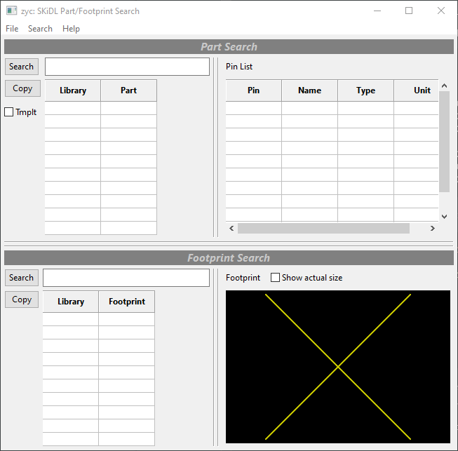
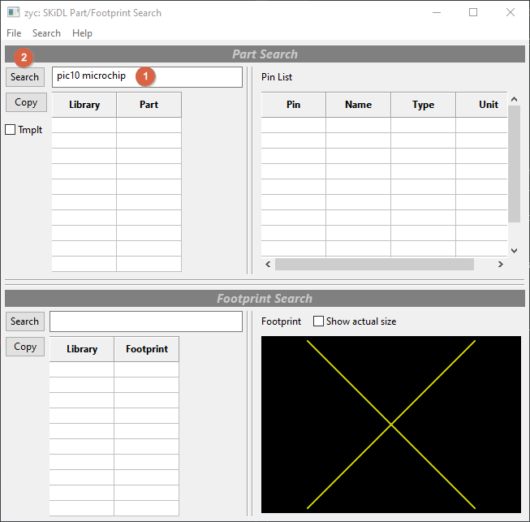
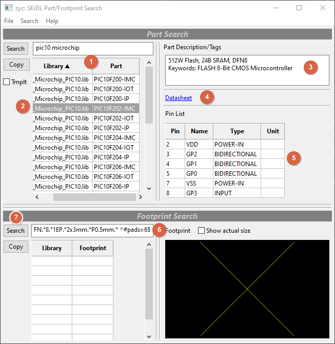
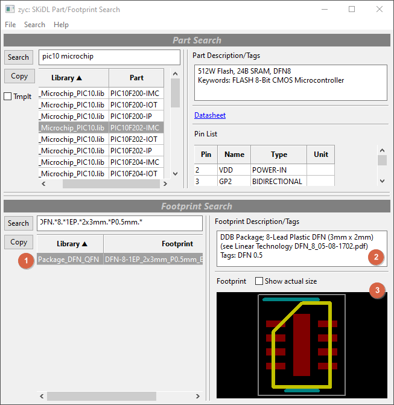
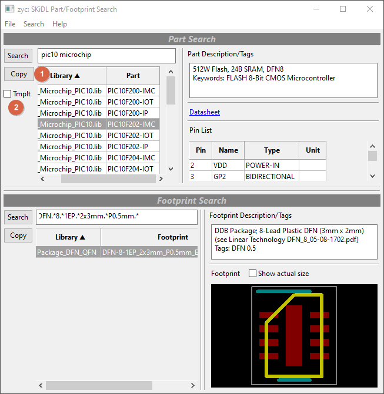
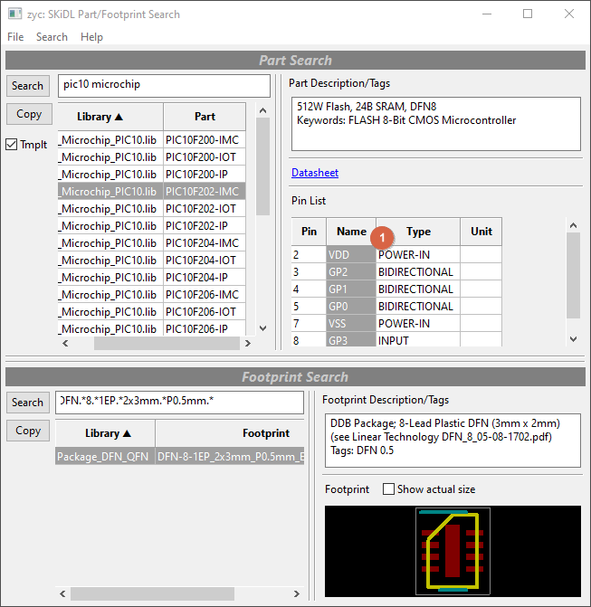
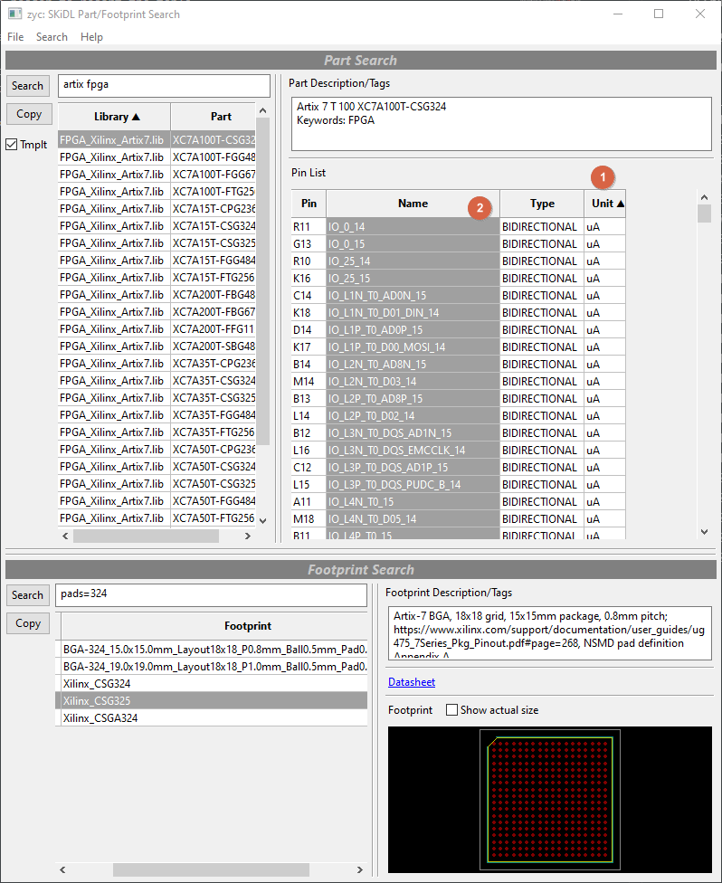
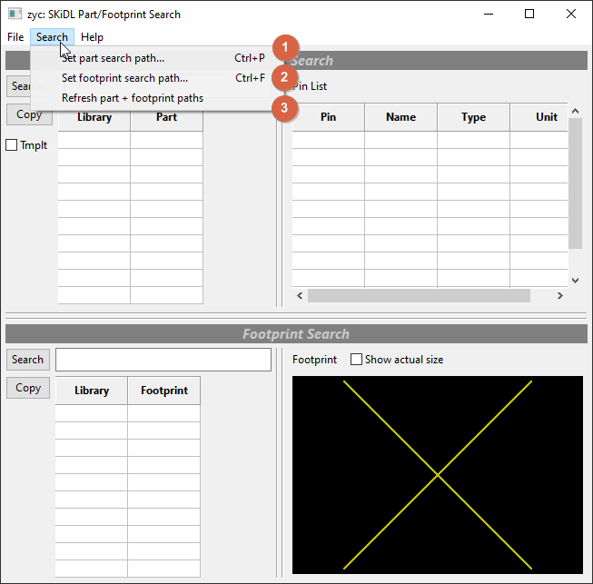

Usage
============

Just enter `zyc` at the command line to bring up the GUI.



`zyc` has two, cooperating panes: a part is searched for and selected in the top pane, and then the
same is done for a footprint in the bottom pane. Then you can paste a SKiDL `Part(...)` instantiation
with the part and footprint into a code editing window.

To begin, start off by typing some search terms describing the part you want
into the upper text-entry box (1) and hit `RETURN` or click the `Search` button (2).



`zyc` will scan through all the available parts looking for your search terms in the library names and
the part names, aliases, descriptions, and keywords. (This initial search takes 20-30 seconds, but
any further searches are quick because the part data gets cached.)
The search terms can contain one or more text strings and/or regular expressions (REs).
Any matching parts are displayed in the Library/Part table (1).
Clicking on a row in the table (2) displays the part's description and keywords (3), datasheet hyperlink (4), and
I/O pin table (5) on the right-side of the pane.



Selecting a part also loads the footprint search text-entry box (6) with an initial set of search terms formed from
the part's list of recommended footprints plus the number of part pins.
You can edit these search terms and add more to modify the footprint search.
(Which is handy because, in this case, the number of pins is wrong since the pin list only contains
six entries but the actual number of pins is eight. So I'll just remove it.)
Then press the `Search` button (7) to scan through all the footprints for matching terms.
(As with parts, the initial footprint search takes 20-30 seconds but further searches are fast
because of caching.)

The footprints that match the search terms appear in the Library/Footprint table (1).
In this case, there is only one.
Selecting it makes the footprint description appear (2) as well as a drawing of the footprint (3).
(If a hyperlink for the package datasheet was available, that would show up as well.)



Once a part and footprint are selected, you can click on the `Copy` button in the upper panel (1)
to place a `Part(...)` instantiation on the clipboard.



Then you can go anywhere (such as your code editor) and paste the clipboard contents to get the part
instantiation:

```python
uc = Part(lib='MCU_Microchip_PIC10.lib', name='PIC10F202-IMC',
          footprint='Package_DFN_QFN:DFN-8-1EP_2x3mm_P0.5mm_EP0.61x2.2mm')
```

If you check the `Tmplt` box (2) and then click the `Copy` button, a part template (instead of an instance)
gets placed on the clipboard and appears as follows:

```python
uc = Part(lib='MCU_Microchip_PIC10.lib', name='PIC10F202-IMC', dest=TEMPLATE,
          footprint='Package_DFN_QFN:DFN-8-1EP_2x3mm_P0.5mm_EP0.61x2.2mm')
```

To make it easier to connect the pins, `zyc` lets you select the names from the pin list column (1).
Right-clicking on the table copies whatever is selected to the clipboard.



Then the pin names can be pasted into the code editor:

```python
uc = Part(lib='MCU_Microchip_PIC10.lib', name='PIC10F202-IMC',
          footprint='Package_DFN_QFN:DFN-8-1EP_2x3mm_P0.5mm_EP0.61x2.2mm')
"VDD", 
"GP2", 
"GP1", 
"GP0", 
"VSS", 
"GP3"
```

Now you can use the strings to connect the microcontroller pins to various nets:

```python
uc = Part(lib='MCU_Microchip_PIC10.lib', name='PIC10F202-IMC',
          footprint='Package_DFN_QFN:DFN-8-1EP_2x3mm_P0.5mm_EP0.61x2.2mm')
uc["VDD", "VSS"] += Net('VCC'), Net('GND')
uc["GP0", "GP1", "GP2", "GP3"] += Bus('GP', 4)
```

`zyc` lets you double-click on any table column header to re-sort the table
based on the contents of that column.
This can be useful in grouping pins by their names, functions, or part units
before selecting and pasting them.
Using an FPGA as an example, double-clicking the `Unit` column (1)
orders the table so you can select all the I/O pins in one of its banks (2).



Then the pins can be pasted:

```python
"IO_0_14", 
"IO_0_15", 
"IO_25_14", 
"IO_25_15", 
"IO_L1N_T0_AD0N_15", 
"IO_L1N_T0_D01_DIN_14", 
"IO_L1P_T0_AD0P_15", 
"IO_L1P_T0_D00_MOSI_14", 
"IO_L2N_T0_AD8N_15", 
"IO_L2N_T0_D03_14", 
"IO_L2P_T0_AD8P_15", 
"IO_L2P_T0_D02_14", 
"IO_L3N_T0_DQS_AD1N_15", 
"IO_L3N_T0_DQS_EMCCLK_14", 
"IO_L3P_T0_DQS_AD1P_15", 
"IO_L3P_T0_DQS_PUDC_B_14", 
"IO_L4N_T0_15", 
"IO_L4N_T0_D05_14", 
"IO_L4P_T0_15", 
"IO_L4P_T0_D04_14", 
"IO_L5N_T0_AD9N_15", 
"IO_L5N_T0_D07_14", 
"IO_L5P_T0_AD9P_15", 
"IO_L5P_T0_D06_14", 
"IO_L6N_T0_D08_VREF_14", 
"IO_L6N_T0_VREF_15", 
"IO_L6P_T0_15", 
"IO_L6P_T0_FCS_B_14", 
"IO_L7N_T1_AD2N_15", 
"IO_L7N_T1_D10_14", 
"IO_L7P_T1_AD2P_15", 
"IO_L7P_T1_D09_14", 
"IO_L8N_T1_AD10N_15", 
"IO_L8N_T1_D12_14", 
"IO_L8P_T1_AD10P_15", 
"IO_L8P_T1_D11_14", 
"IO_L9N_T1_DQS_AD3N_15", 
"IO_L9N_T1_DQS_D13_14", 
"IO_L9P_T1_DQS_14", 
"IO_L9P_T1_DQS_AD3P_15", 
"IO_L10N_T1_AD11N_15", 
"IO_L10N_T1_D15_14", 
"IO_L10P_T1_AD11P_15", 
"IO_L10P_T1_D14_14", 
"IO_L11N_T1_SRCC_14", 
"IO_L11N_T1_SRCC_15", 
"IO_L11P_T1_SRCC_14", 
"IO_L11P_T1_SRCC_15", 
"IO_L12N_T1_MRCC_14", 
"IO_L12N_T1_MRCC_15", 
"IO_L12P_T1_MRCC_14", 
"IO_L12P_T1_MRCC_15", 
"IO_L13N_T2_MRCC_14", 
"IO_L13N_T2_MRCC_15", 
"IO_L13P_T2_MRCC_14", 
"IO_L13P_T2_MRCC_15", 
"IO_L14N_T2_SRCC_14", 
"IO_L14N_T2_SRCC_15", 
"IO_L14P_T2_SRCC_14", 
"IO_L14P_T2_SRCC_15", 
"IO_L15N_T2_DQS_ADV_B_15", 
"IO_L15N_T2_DQS_DOUT_CSO_B_14", 
"IO_L15P_T2_DQS_15", 
"IO_L15P_T2_DQS_RDWR_B_14", 
"IO_L16N_T2_A15_D31_14", 
"IO_L16N_T2_A27_15", 
"IO_L16P_T2_A28_15", 
"IO_L16P_T2_CSI_B_14", 
"IO_L17N_T2_A13_D29_14", 
"IO_L17N_T2_A25_15", 
"IO_L17P_T2_A14_D30_14", 
"IO_L17P_T2_A26_15", 
"IO_L18N_T2_A11_D27_14", 
"IO_L18N_T2_A23_15", 
"IO_L18P_T2_A12_D28_14", 
"IO_L18P_T2_A24_15", 
"IO_L19N_T3_A09_D25_VREF_14", 
"IO_L19N_T3_A21_VREF_15", 
"IO_L19P_T3_A10_D26_14", 
"IO_L19P_T3_A22_15", 
"IO_L20N_T3_A07_D23_14", 
"IO_L20N_T3_A19_15", 
"IO_L20P_T3_A08_D24_14", 
"IO_L20P_T3_A20_15", 
"IO_L21N_T3_DQS_A06_D22_14", 
"IO_L21N_T3_DQS_A18_15", 
"IO_L21P_T3_DQS_14", 
"IO_L21P_T3_DQS_15", 
"IO_L22N_T3_A04_D20_14", 
"IO_L22N_T3_A16_15", 
"IO_L22P_T3_A05_D21_14", 
"IO_L22P_T3_A17_15", 
"IO_L23N_T3_A02_D18_14", 
"IO_L23N_T3_FWE_B_15", 
"IO_L23P_T3_A03_D19_14", 
"IO_L23P_T3_FOE_B_15", 
"IO_L24N_T3_A00_D16_14", 
"IO_L24N_T3_RS0_15", 
"IO_L24P_T3_A01_D17_14", 
"IO_L24P_T3_RS1_15"
```

This is definitely something that would be difficult to type manually without making a mistake!

`zyc` requires minimal setup.
By default, it will use the `KICAD_SYMBOL_DIR` environment variable to look for part libraries,
and it will look for the global footprint library table (`fp_lib_table`) in the default location
where KiCad installs it on various OSes.
You can also add or change the directories that are searched for part libraries (1) or for
`fp_lib_table` files (2) using the menu items below:



It may happen that you change some part libraries or add more footprint files while `zyc` is
running. If so, you'll want to refresh the part and footprint caches (3). 


